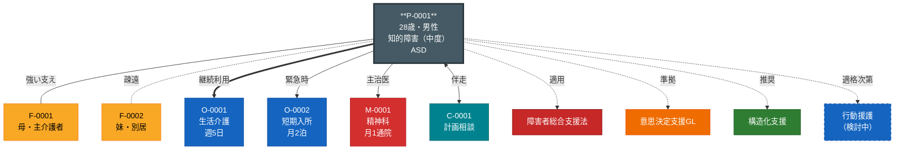
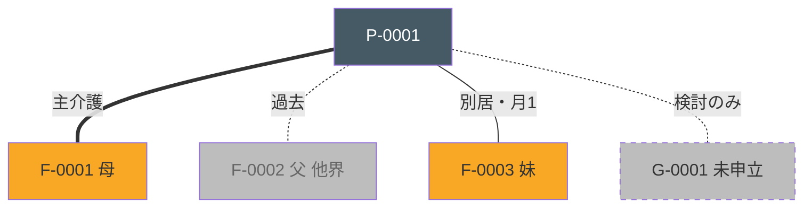
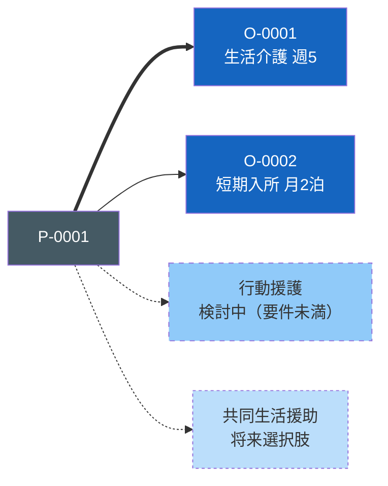
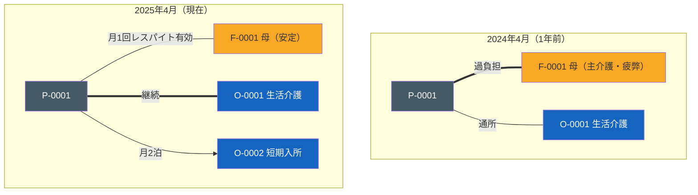
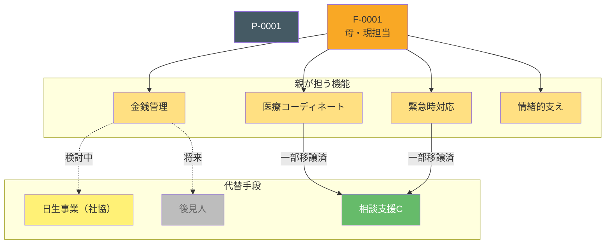

<!-- allow-realname -->

# ecomap-from-relations skill

## 用途

対象当事者（P-XXXX）の relations ネットワークから **Mermaid 図としてのエコマップ** を自動生成。

人が見て関係性を把握しやすく、Obsidian 上で直接レンダリングされる。vault の `ecomap-generator` と用途は重なるが:

- `ecomap-generator`: D3.js ベースのインタラクティブグラフ（単一HTML）
- **ecomap-from-relations**: Mermaid ベースのノート内埋め込み（軽量・簡潔）

両者は補完関係。計画相談の **ノート内で見る** 軽量版として本スキル。

## 入力

- 当事者ID（必須）: 例 `P-0001`
- 焦点（任意）: `all` / `family` / `services` / `medical` / `informal`（デフォルト `all`）
- 表示範囲（任意）: 1-hop / 2-hop（デフォルト 1-hop）
- 保存先（任意）: `10_People/{id}.md` に追記 / 単独ファイル生成

## 出力フォーマット（Mermaid）

```markdown
## エコマップ


```

## 線の意味

| 線種 | 意味 | Mermaid記法 |
|---|---|---|
| `===` 太線 | 強い関係・中核的支援 | ==> |
| `---` 普通線 | 通常の関係 | --> |
| `-.-.-` 点線 | 弱い関係・疎遠 | -.-> |
| `<-->` 双方向 | 相互関係 | <--> |
| `-/-/-/` ギザギザ | ストレス・葛藤 | ラベルで表現 |

## ノードの種類と色

| 種類 | cssclass | 色 | 対象 |
|---|---|---|---|
| 本人 | `person` | Blue-Gray | P-XXXX |
| 家族 | `family` | Amber | F-XXXX |
| 事業所 | `service` | Blue | O-XXXX, currently-using |
| 事業所（検討中） | `service_pending` | Blue点線 | considered |
| 医療 | `medical` | Red | M-XXXX |
| 相談員 | `consultant` | Teal | C-XXXX |
| 法令 | `law` | Red | 60_Laws/ |
| ガイドライン | `guideline` | Orange | 61_Guidelines/ |
| 技法 | `method` | Green | 64_Methods/ |
| 関係機関 | `org` | Teal | 67_Orgs/ |

層別配色は `.obsidian/snippets/layer-colors.css` と整合。

## 実行手順（Claude 向け）

### 1. 対象ノートを読む

- `10_People/{id}.md` を Read
- frontmatter の `relations` と本文の関係者セクションを取得
- `diagnosis`, `disability_cert`, `primary_supporter` 等の基本情報

### 2. 周辺データ収集

#### 2.1 具体関係者（40_Stakeholders/）
- 本人 relations の wikilink 内で `F-XXXX` / `O-XXXX` / `M-XXXX` / `G-XXXX` / `S-XXXX` / `C-XXXX` / `N-XXXX` プレフィックスのものを抽出
- `40_Stakeholders/{ID}.md` が存在すれば Read（役割・関係情報取得）

#### 2.2 50_Resilience/
- 親が担う機能（CareRole）を `50_Resilience/CareRoles/` で確認
- 親亡き後の代替手段（Substitutes）

#### 2.3 relations の知識層先（焦点 `all` の時）
- 60-67 層の weight ≥ 0.8 のものを抽出（重要な根拠のみ）

### 3. 焦点で絞り込み

- `family`: F-XXXX と CareRole のみ
- `services`: O-XXXX, currently-using, considered, eligible-service
- `medical`: M-XXXX, 精神通院医療等の医療関連
- `informal`: N-XXXX, ピア、地域資源
- `all`: 全部（ただし読みやすさ優先で重要度上位）

### 4. Mermaid 記法で構築

```
graph TD
    P["{本人ID}<br/>{基本情報}"]:::person
    ...
```

- 中心に本人
- 周囲に関係者をカテゴリ別に配置
- 線種・太さで関係の質を表現
- ラベルで接触頻度・役割を併記

### 5. スタイル定義

`classDef` で層別の色を定義。CSS snippet（`.obsidian/snippets/layer-colors.css`）と整合的な色を使用。

### 6. 出力

#### デフォルト: 標準出力
- Claude の応答として Mermaid ブロックを表示
- 本人ノートに手動追加したければコピー可

#### 保存オプション
- `10_People/{id}.md` の末尾に `## エコマップ` として追記
- または `10_People/{id}_ecomap.md` として単独保存

## 焦点別サンプル

### 焦点 `family`



### 焦点 `services`



### 焦点 `all`（包括）

全 relations + 主要 stakeholders を含む。見やすさのため重要度で絞る。

## 視覚的工夫

### 線の太さ（Mermaidの制限）
- Mermaid標準では線の太さは固定
- **ラベル** で強度を補足（「強い支え」「週3回」等）
- スタイルシートで編集する場合は ` linkStyle {順序} stroke-width:4px` で個別指定

### ノードサイズ
- Mermaid の自動レイアウト
- **改行 `<br/>`** で情報量を調整
- 中心ノード（本人）は大きく表示されるよう情報量多めに

### レイアウト方向
- `graph TD`（上→下）: 階層が分かりやすい
- `graph LR`（左→右）: 横長で印刷向き
- `graph TB`（上→下・省略形）
- 焦点により選択

## 応用パターン

### 時系列エコマップ（Before/After）



### CareRole 可視化（親亡き後設計）



## 禁忌・注意事項

### 実名の取扱い

- **実名は一切出力しない**（F-XXXX 等の仮名IDのみ）
- `40_Stakeholders/` を読む際、表示名が実名にならないよう注意
- 表示ラベルには役割・関係（「母」「妹」等）は可、固有名詞は不可

### 過剰な情報密度

- 相関が複雑だとエコマップが読めなくなる
- 10ノード以下が理想、最大15
- それ以上になる場合は **焦点** で絞る

### 客観性の限界

- 関係の「強さ」の線は支援者の主観
- 本人・家族の見方と異なる可能性
- 「これは支援者側の見立て」と注釈付け可

## 運用

### いつ作るか

- 初回アセスメント完了時
- サービス担当者会議の資料として
- 半年〜1年毎の更新
- 環境変化時（転居・家族の変化）

### 既存 ecomap-generator との使い分け

| 場面 | 推奨 |
|---|---|
| ノート内で簡潔に見たい | **ecomap-from-relations**（本スキル） |
| インタラクティブに探索 | [[ecomap-generator]] |
| 印刷用に1枚絵 | 両者から選択 |
| 定期報告書 | **ecomap-from-relations** |

## 関連スキル

- `ecomap-generator`: D3.jsインタラクティブ版
- `support-hypothesis`: relations から支援仮説生成（補完関係）
- `visit-prep`: 訪問前ブリーフィング
- `monthly-summary`: 月次まとめ

## 関連アセスメント

- [[65_Assessments/エコマップ]]: エコマップの概念・意義
- [[65_Assessments/ニーズ整理票]]: ニーズとの対応
- [[65_Assessments/障害支援区分認定調査]]

## 将来拡張

- **自動配色**: 層別配色を自動判定（frontmatter `type` から）
- **相互リンク**: Obsidian wikilink として埋め込み、クリックで詳細
- **時系列**: 過去のエコマップを履歴比較（差分強調）
- **Neo4j 連携**: [[90_Meta/neo4j-integration-design]] との連携で最短経路・中心性を可視化
