<!-- allow-realname -->
---
type: person
id: P-0002
status: active
diagnosis: [知的障害（重度）, 自閉スペクトラム症, 強度行動障害]
disability_cert: 療育手帳A
service_plan_id: SP-0002
primary_supporter: F-0011
cssclasses: [layer-person]
created: 2026-04-20
updated: 2026-04-20
tags: [person, sample, strong-behavioral]
relations:
  - to: "[[63_Disorders/知的障害]]"
    type: has-characteristic
    weight: 1.0
    evidence: "療育手帳A（重度・IQ概ね35未満）"
  - to: "[[63_Disorders/自閉スペクトラム症]]"
    type: has-characteristic
    weight: 1.0
    evidence: "3歳時診断・重度の感覚過敏（聴覚）・同一性固執"
  - to: "[[63_Disorders/強度行動障害]]"
    type: has-characteristic
    weight: 1.0
    evidence: "行動関連項目 18点（令和6年3月認定）"
  - to: "[[63_Disorders/てんかん]]"
    type: comorbid-with
    weight: 0.9
    evidence: "複雑部分発作、月1-2回"
  - to: "[[60_Laws/障害者総合支援法]]"
    type: applies-to
    weight: 1.0
  - to: "[[60_Laws/障害者虐待防止法]]"
    type: applies-to
    weight: 1.0
    rationale: "重度・要保護性極めて高い"
  - to: "[[65_Assessments/行動関連項目]]"
    type: evidence-based
    weight: 1.0
    evidence: "18点（過食・他害・自傷・突発行動が2点）"
  - to: "[[65_Assessments/障害支援区分認定調査]]"
    type: evidence-based
    weight: 1.0
    evidence: "区分6"
  - to: "[[66_Services/共同生活援助]]"
    type: currently-using
    weight: 1.0
    source: "[[O-0011]]"
    rationale: "日中サービス支援型GH・24時間体制"
  - to: "[[66_Services/行動援護]]"
    type: currently-using
    weight: 1.0
    rationale: "通院同行・外出支援、行動関連18点で継続"
  - to: "[[66_Services/生活介護]]"
    type: currently-using
    weight: 1.0
    source: "[[O-0012]]"
    rationale: "重度障害者支援加算II算定事業所"
  - to: "[[66_Services/精神通院医療]]"
    type: currently-using
    weight: 1.0
    rationale: "抗てんかん薬・行動安定薬の継続処方"
  - to: "[[66_Services/短期入所]]"
    type: considered
    weight: 0.5
    rationale: "現状GHで充足、緊急時の備えとして枠確保検討"
  - to: "[[64_Methods/強度行動障害支援]]"
    type: evidence-based
    weight: 1.0
    rationale: "GH・生活介護双方で体系的実施"
  - to: "[[64_Methods/構造化支援]]"
    type: evidence-based
    weight: 1.0
    evidence: "視覚スケジュール・個別作業エリア・物理的仕切り"
  - to: "[[64_Methods/ABC分析]]"
    type: evidence-based
    weight: 0.95
    evidence: "他害頻度が週3回→月2回に改善（2025年度実績）"
  - to: "[[64_Methods/ポジティブ行動支援]]"
    type: evidence-based
    weight: 0.9
  - to: "[[62_Frameworks/トラウマインフォームドケア]]"
    type: recommended
    weight: 0.85
    rationale: "過去の他施設での不適切対応歴あり、配慮必須"
  - to: "[[61_Guidelines/強度行動障害支援者養成研修テキスト]]"
    type: compliance-required
    weight: 1.0
    rationale: "GH・生活介護従事者の実践研修修了必要"
  - to: "[[61_Guidelines/身体拘束適正化の手引]]"
    type: compliance-required
    weight: 1.0
    rationale: "過去の他害時対応で三要件判断が頻発"
  - to: "[[61_Guidelines/意思決定支援ガイドライン]]"
    type: compliance-required
    weight: 0.95
  - to: "[[61_Guidelines/障害者施設における性的虐待の防止と対応]]"
    type: compliance-required
    weight: 1.0
    rationale: "重度ID・コミュニケーション困難で高リスク群"
  - to: "[[67_Orgs/基幹相談支援センター]]"
    type: escalate-to
    weight: 0.9
    rationale: "困難ケース・複数事業所調整のハブ"
  - to: "[[67_Orgs/性暴力被害者ワンストップ支援センター]]"
    type: escalate-to
    weight: 0.8
    condition: "被害疑い時 #8891"
---

# P-0002（架空サンプル）

> ⚠️ これは `support-hypothesis` スキル検証用の **架空事例**。強度行動障害のある方の典型プロファイル。

## 基本情報

- 年齢 / 性別: 35歳 / 男性
- 居住形態: **日中サービス支援型GH**（[[O-0011]]、入居5年目）
- 収入: 障害基礎年金1級 + 生活介護工賃（月額約2,000円）
- 主介護者: [[F-0011]]（父、70代）。母 [[F-0012]] は5年前に他界

## 強み（Strengths）

- 決まった作業ルーティン（プラ部品の袋詰め）に1時間集中可能
- 特定の職員（[[C-0011]]・男性支援員）と強い信頼関係
- 音楽（特にドラム系）で落ち着ける
- 食事への強いこだわり（決まったメニューで安心）

## 禁忌 / 苦手（Contraindications）

- 大音量（救急車・運動会放送・犬の鳴き声）→ 耳塞ぎ・他害
- 予告なしの予定変更 → パニック・自傷（頭突き）
- 初対面者との長時間接触 → 緊張高まり突発行動
- 待ち時間15分超 → 異食（紙・布）
- 体調不良（便秘・頭痛）→ 他害頻度が倍増

## 推奨ケア（Preferred Care）

- 視覚的スケジュール（絵カード＋時計）を朝・昼・夕で確認
- 移行カード（「おわり」「つぎ」）を作業転換時に提示
- ノイズキャンセリングヘッドホンを外出時に常時携帯
- 男性スタッフ中心の対応（特に [[C-0011]] の異動時は3か月前から段階移行）
- 体調変化の観察（排便記録・睡眠時間・食欲）を日次共有

## コミュニケーション特性

- 発語: 単語レベル（「ごはん」「くるま」「おわり」「いや」）
- 受容: 具体的で短い指示は理解（「靴はく」「座る」）
- 抽象概念（「あとで」「もうすぐ」）は理解困難 → 視覚化必須
- 不快時は耳塞ぎ・身体の硬直 → 体調シグナルとして読み取る
- 絵カード（PECS風）で2語レベルの要求表出可能

## 関係者

- 家族: [[F-0011]]（父・70代・月2回面会）
- 事業所: [[O-0011]]（GH）/ [[O-0012]]（生活介護）
- 医療: [[M-0011]]（精神科主治医・2週毎通院）/ [[M-0012]]（内科・服薬管理）
- 後見等: [[G-0001]]（専門職後見人・弁護士）
- 社協: [[S-0001]]（日常生活自立支援事業は現状利用なし、成年後見人が金銭管理）
- 相談支援: [[C-0011]]（計画相談）

## 現在のサービス等利用計画

| サービス | 事業所 | 支給量 | 備考 |
|---|---|---|---|
| 共同生活援助（日中支援型） | [[O-0011]] | 月30日 | 24時間体制 |
| 生活介護 | [[O-0012]] | 月22日 | 重度障害者支援加算II |
| 行動援護 | 複数 | 月20時間 | 通院・外出同行 |
| 短期入所 | 予約枠 | 緊急時のみ | 連携事業所2箇所 |
| 計画相談支援 | [[C-0011]] | モニタリング6か月毎 | 状況により3か月毎も |

## 支援方針（令和6年度）

1. **現在の安定の維持**: ABC分析データの蓄積（他害頻度トレンド）と環境調整の微修正
2. **[[C-0011]] 定年に伴う引継ぎ準備**: 3年以内の体系的引継ぎを来年度から開始
3. **父 [[F-0011]] の高齢化対応**: 後見人 [[G-0001]] との連携強化、面会継続支援
4. **医療の一貫性**: てんかんと行動障害の鑑別（発作 vs 行動）の精度向上
5. **性に関する支援**: 35歳成人として [[64_Methods/知的障害のある人への性教育]] の段階的導入検討（本人理解度に応じ絵本レベルから）

## 最近のエピソード
```dataview
LIST
FROM "20_Episodes"
WHERE contains(file.name, this.id)
SORT file.name DESC
LIMIT 10
```

## 関連する知見
```dataview
LIST
FROM "30_Insights"
WHERE contains(file.outlinks, this.file.link)
```

## CareRole（親亡き後設計）
```dataview
TABLE current_holder, risk_level, substitute_status
FROM "50_Resilience/CareRoles"
WHERE contains(file.name, this.id)
```

## 知識層との接続ハイライト

### 最優先コンプライアンス（weight ≥ 0.95）
- [[61_Guidelines/強度行動障害支援者養成研修テキスト]]: 従事者研修要件
- [[61_Guidelines/身体拘束適正化の手引]]: 他害時の三要件判断
- [[61_Guidelines/障害者施設における性的虐待の防止と対応]]: 重度ID保護
- [[60_Laws/障害者虐待防止法]]: 通報義務

### 現行技法（エビデンス実績あり）
- [[64_Methods/強度行動障害支援]]: weight 1.0、事業所で体系実施
- [[64_Methods/構造化支援]]: weight 1.0、視覚的環境確立
- [[64_Methods/ABC分析]]: weight 0.95、他害頻度改善の実績データあり

### モニタリング時の重点
- 行動関連項目の変動（18点→改善or悪化）
- てんかん発作と行動障害の鑑別
- 父 [[F-0011]] の健康状態（親亡き後の緊急度）
- [[C-0011]] 引継ぎ進捗

## エコマップ

```mermaid
graph TD
    P["<b>P-0002</b><br/>35歳・男性<br/>重度知的+ASD+強度行動障害<br/>行動関連18点・区分6"]:::person

    %% 家族
    F1["F-0011<br/>父・70代"]:::family
    F2["F-0012<br/>母 他界"]:::family_deceased
    P ---|月2回面会| F1
    P -.-|他界| F2

    %% 後見・金銭管理
    G1["G-0001<br/>専門職後見人"]:::guardian
    P ==>|財産管理| G1

    %% 事業所
    O1["O-0011<br/>GH 日中支援型<br/>入居5年"]:::service
    O2["O-0012<br/>生活介護<br/>重度加算II"]:::service
    C1["C-0011<br/>計画相談"]:::consultant
    P ===|24h生活拠点| O1
    P ==>|日中活動| O2
    P <-->|6か月モニタ| C1

    %% 医療
    M1["M-0011<br/>精神科 2週毎"]:::medical
    M2["M-0012<br/>内科・服薬管理"]:::medical
    P -->|行動安定薬| M1
    P -->|抗てんかん薬| M2

    %% 行動援護
    SV_K["行動援護<br/>月20h 複数事業所"]:::service
    P ==>|通院・外出| SV_K

    %% コンプライアンス
    subgraph 必須コンプライアンス
        GL_KYO["強度行動障害研修"]:::guideline
        GL_SHIN["身体拘束適正化"]:::guideline
        GL_SEX["性的虐待防止"]:::guideline
    end
    O1 -.->|従事者要件| GL_KYO
    P -.->|他害時三要件| GL_SHIN
    P -.->|重度ID高リスク| GL_SEX

    %% 技法（実施中）
    M_KYO["強度行動障害支援"]:::method
    M_STR["構造化支援"]:::method
    M_ABC["ABC分析<br/>他害 週3→月2"]:::method
    P ==>|実施中 1.0| M_KYO
    P ==>|実施中 1.0| M_STR
    P ==>|実績あり 0.95| M_ABC

    %% 適用法令
    LAW1["総合支援法"]:::law
    LAW2["虐待防止法"]:::law
    P -.-> LAW1
    P -.-> LAW2

    ORG1["基幹相談支援C"]:::org
    P -.->|引継ぎ時| ORG1

    classDef person fill:#455A64,stroke:#263238,color:#fff,stroke-width:3px
    classDef family fill:#F9A825,stroke:#F57F17,color:#000
    classDef family_deceased fill:#BDBDBD,stroke:#757575,color:#424242
    classDef guardian fill:#6A1B9A,stroke:#4A148C,color:#fff
    classDef service fill:#1565C0,stroke:#0D47A1,color:#fff
    classDef medical fill:#D32F2F,stroke:#B71C1C,color:#fff
    classDef consultant fill:#00838F,stroke:#006064,color:#fff
    classDef law fill:#C62828,stroke:#8E0000,color:#fff
    classDef guideline fill:#EF6C00,stroke:#E65100,color:#fff
    classDef method fill:#2E7D32,stroke:#1B5E20,color:#fff
    classDef org fill:#00838F,stroke:#006064,color:#fff
```



**特徴**: 親亡き後の **第4段階** 完了（GH入居5年）。家族より事業所ネットワークが生活主軸。ABC分析の継続実施で他害頻度改善が核心成果。後見人との連携で金銭管理確立済。
