<!-- allow-realname -->
---
type: person
id: P-0003
status: active
diagnosis: [統合失調症, 軽度知的障害]
disability_cert: 精神障害者保健福祉手帳2級 / 療育手帳B
service_plan_id: SP-0003
primary_supporter: self
cssclasses: [layer-person]
created: 2026-04-20
updated: 2026-04-20
tags: [person, sample, psychiatric, regional-transition]
relations:
  - to: "[[63_Disorders/統合失調症]]"
    type: has-characteristic
    weight: 1.0
    evidence: "22歳発症、3回の入院歴、現在は陰性症状・認知機能低下が主"
  - to: "[[63_Disorders/知的障害]]"
    type: has-characteristic
    weight: 0.7
    evidence: "境界知能〜軽度（療育手帳B）、発症前は就労経験あり"
  - to: "[[63_Disorders/うつ病]]"
    type: comorbid-with
    weight: 0.5
    rationale: "抑うつエピソード反復、気分変動時は要注意"
  - to: "[[60_Laws/障害者総合支援法]]"
    type: applies-to
    weight: 1.0
  - to: "[[60_Laws/精神保健福祉法]]"
    type: applies-to
    weight: 1.0
    rationale: "過去3回医療保護入院・現在任意通院"
  - to: "[[60_Laws/障害者虐待防止法]]"
    type: applies-to
    weight: 1.0
  - to: "[[66_Services/地域移行支援]]"
    type: discontinued
    weight: 0.9
    rationale: "5年前に地域移行完了、現在は定着期"
  - to: "[[66_Services/地域定着支援]]"
    type: currently-using
    weight: 1.0
    rationale: "24時間連絡体制、緊急訪問実績あり"
  - to: "[[66_Services/自立生活援助]]"
    type: discontinued
    weight: 0.6
    rationale: "初期1年使用、現在は定着支援のみ"
  - to: "[[66_Services/居宅介護]]"
    type: currently-using
    weight: 0.8
    rationale: "週3回・家事援助中心、服薬支援含む"
  - to: "[[66_Services/就労継続支援B型]]"
    type: currently-using
    weight: 1.0
    source: "[[O-0021]]"
    rationale: "週3日4時間、簡単な軽作業"
  - to: "[[66_Services/精神通院医療]]"
    type: currently-using
    weight: 1.0
    rationale: "月2回通院、抗精神病薬（非定型）継続"
  - to: "[[64_Methods/SST]]"
    type: evidence-based
    weight: 0.9
    rationale: "[[O-0021]] でのグループSST参加"
  - to: "[[64_Methods/認知行動療法]]"
    type: recommended
    weight: 0.5
    rationale: "通院先クリニックで部分的導入検討中"
  - to: "[[62_Frameworks/ストレングスモデル]]"
    type: underpinned-by
    weight: 0.95
    rationale: "リカバリー志向の地域生活支援"
  - to: "[[62_Frameworks/トラウマインフォームドケア]]"
    type: recommended
    weight: 0.8
    rationale: "強制入院歴あり、再入院時の配慮必須"
  - to: "[[62_Frameworks/パーソンセンタードプランニング]]"
    type: underpinned-by
    weight: 0.9
  - to: "[[62_Frameworks/ICF]]"
    type: underpinned-by
    weight: 0.85
  - to: "[[61_Guidelines/地域移行支援の手引]]"
    type: complements
    weight: 0.85
    rationale: "移行完了後も にも包括 文脈での再入院予防"
  - to: "[[61_Guidelines/意思決定支援ガイドライン]]"
    type: compliance-required
    weight: 0.95
    rationale: "任意入院判断・結婚等の重要決定時に適用"
  - to: "[[65_Assessments/ニーズ整理票]]"
    type: evidence-based
    weight: 0.85
    rationale: "3か月毎の定期見直し実施中"
  - to: "[[67_Orgs/精神保健福祉センター]]"
    type: escalate-to
    weight: 0.85
    rationale: "危機介入・入院判断時"
  - to: "[[67_Orgs/基幹相談支援センター]]"
    type: escalate-to
    weight: 0.7
  - to: "[[67_Orgs/障害者就業・生活支援センター]]"
    type: considered
    weight: 0.6
    rationale: "将来A型・一般就労への足がかり検討"
---

# P-0003（架空サンプル）

> ⚠️ `support-hypothesis` 検証用の **架空事例**。精神障害×地域移行の典型。

## 基本情報

- 年齢 / 性別: 43歳 / 女性
- 居住形態: **一人暮らし**（アパート、市営住宅）、地域移行から5年
- 収入: 障害基礎年金2級 + 就労継続B型工賃 + 生活保護（不足分補填）
- 主介護者: 自己（独身、実家関係は疎遠）

## 経過

- 22歳: 統合失調症発症、初回入院
- 25-35歳: 3回の入退院、計 **通算8年の精神科病院入院**
- 38歳: [[66_Services/地域移行支援]] 開始、GH体験
- 38-39歳: GH 1年→自立生活援助で一人暮らしへ
- 39歳〜現在: アパートで一人暮らし、[[66_Services/地域定着支援]] 継続

## 強み（Strengths）

- 服薬自己管理がほぼ確立（5年間ほぼ中断なし）
- 同じB型事業所に5年継続勤務
- 料理の基本スキルあり（病前に経験）
- ピアサポートグループ参加、他の当事者との関係構築
- 日記を書く習慣（気分・睡眠・服薬の記録）

## 禁忌 / 苦手（Contraindications）

- 強い対人衝突・批判的口調 → 症状悪化リスク
- 急な生活環境変化 → 不眠→再発兆候
- 睡眠4時間以下の日が3日連続 → 注意信号
- 家族との接触（実家）→ 過去のトラウマ関連、希望時のみ
- 経済的困難 → 強い不安・抑うつ

## 推奨ケア（Preferred Care）

- 週1回の訪問（[[66_Services/地域定着支援]]）での雑談と状態観察
- 月2回の服薬確認（[[66_Services/居宅介護]] 訪問時に薬カレンダー点検）
- 症状悪化兆候（睡眠/食欲/日記の空白）の早期察知
- 危機時の連絡フロー明確化（本人→定着支援C→主治医）
- 強制ではない選択肢の提示（[[62_Frameworks/ストレングスモデル]]）

## コミュニケーション特性

- 発語: 流暢、知的機能は軽度障害〜境界知能
- 受容: 抽象概念も概ね理解可、ただし疲労時は短文化必要
- 症状悪化時: 被害関係念慮、会話の脈絡が乱れる（早期察知の指標）
- 書くことが得意 → 日記・手紙でのコミュニケーション可

## 関係者

- 家族: [[F-0021]]（実父）／ [[F-0022]]（実姉）ともに関係疎遠
- 事業所: [[O-0021]]（就労継続B型、5年継続）
- 医療: [[M-0021]]（精神科クリニック主治医、10年継続）
- 後見等: なし（判断能力維持、導入不要と判断）
- 社協: 日常生活自立支援事業 検討段階
- 相談支援: [[C-0021]]（計画相談・定着支援）
- ピア: [[N-0021]]（当事者仲間、リカバリーカレッジで知り合い）

## 現在のサービス等利用計画

| サービス | 事業所 | 支給量 | 備考 |
|---|---|---|---|
| 地域定着支援 | [[C-0021]] | 24時間連絡体制 | 緊急時訪問実績 年3回 |
| 居宅介護（家事援助） | 週3回×90分 | 服薬・掃除・買物 |
| 就労継続B型 | [[O-0021]] | 週3日4時間 | 工賃月額15,000円 |
| 精神通院医療 | [[M-0021]] | 月2回 | 自己負担1割 |
| 計画相談支援 | [[C-0021]] | 6か月毎モニタリング |

## 支援方針（令和6年度）

1. **再発予防の安定継続**: 現状のサービス量を維持、環境変化を避ける
2. **就労発展の検討**: 本人の希望があれば [[67_Orgs/障害者就業・生活支援センター]] 経由でA型見学から
3. **家族関係のサポート**: 実父 [[F-0021]] の高齢化に伴い、関係修復・葬儀参加等の意思確認
4. **ピアサポート強化**: リカバリーカレッジでの学習継続、ピアサポーター資格取得の関心あり
5. **判断能力低下リスクへの備え**: 将来の成年後見必要性の段階的モニタリング（現時点では不要）

## 最近のエピソード
```dataview
LIST
FROM "20_Episodes"
WHERE contains(file.name, this.id)
SORT file.name DESC
LIMIT 10
```

## 関連する知見
```dataview
LIST
FROM "30_Insights"
WHERE contains(file.outlinks, this.file.link)
```

## 知識層との接続ハイライト

### 最優先コンプライアンス
- [[61_Guidelines/意思決定支援ガイドライン]]: 任意/医療保護入院の判断時
- [[60_Laws/精神保健福祉法]]: R6改正の入院者訪問支援事業も情報提供

### 現行の支援基盤
- [[64_Methods/SST]]: 対人関係スキル維持（事業所で継続）
- [[62_Frameworks/ストレングスモデル]]: リカバリー志向の支援の理論基盤
- [[62_Frameworks/トラウマインフォームドケア]]: 強制入院歴を踏まえた関わり

### 緊急時エスカレーション
- 睡眠4h×3日連続 → [[C-0021]] → [[M-0021]] → 必要なら [[67_Orgs/精神保健福祉センター]]
- 再入院判断 → [[60_Laws/精神保健福祉法]] 入院形態の適切性

### モニタリング時の重点
- 服薬アドヒアランス（飲み忘れ有無）
- 睡眠・食欲・日記記入の継続性
- 就労意欲・ピア活動の発展
- 実家（家族）との連絡希望の変化

## エコマップ

```mermaid
graph TD
    P["<b>P-0003</b><br/>43歳・女性<br/>統合失調症+軽度ID<br/>地域移行5年・一人暮らし"]:::person

    %% 家族（疎遠）
    F1["F-0021<br/>実父"]:::family_distant
    F2["F-0022<br/>実姉"]:::family_distant
    P -.-|関係疎遠| F1
    P -.-|関係疎遠| F2

    %% 事業所
    O1["O-0021<br/>就労継続B型<br/>5年継続"]:::service
    C1["C-0021<br/>計画相談+地域定着<br/>24h連絡体制"]:::consultant
    P ==>|週3日4h| O1
    P ===|24h伴走| C1

    %% 医療
    M1["M-0021<br/>精神科クリニック<br/>10年継続"]:::medical
    P ==>|月2回通院| M1

    %% 居宅介護
    SV_K["居宅介護<br/>週3回 家事+服薬"]:::service
    P ==>|服薬確認| SV_K

    %% ピア
    N1["N-0021<br/>ピア仲間<br/>リカバリーカレッジ"]:::informal
    P <-->|相互支援| N1

    %% 早期警告指標
    WATCH["睡眠4h×3日連続<br/>= 早期警告"]:::alert
    P -.->|観察指標| WATCH

    %% 支援フレームワーク
    subgraph 支援思想
        FW_STR["ストレングスモデル"]:::framework
        FW_TIC["TIC"]:::framework
        FW_PCP["PCP"]:::framework
    end
    P -.->|underpinned 0.95| FW_STR
    P -.->|強制入院歴に配慮 0.8| FW_TIC
    P -.-> FW_PCP

    %% 技法
    M_SST["SST"]:::method
    P ==>|事業所で継続| M_SST

    %% コンプライアンス
    GL_IK["意思決定支援GL"]:::guideline
    P -.->|重要決定時| GL_IK

    %% 法令
    LAW1["精神保健福祉法"]:::law
    LAW2["総合支援法"]:::law
    P -.-> LAW1
    P -.-> LAW2

    %% エスカレーション
    ORG1["精神保健福祉C"]:::org
    ORG2["基幹相談支援C"]:::org
    P -.->|再発兆候時| ORG1
    P -.->|複合課題時| ORG2

    %% 検討中
    SV_FUT["A型・一般就労"]:::service_pending
    P -.->|将来選択肢| SV_FUT

    classDef person fill:#455A64,stroke:#263238,color:#fff,stroke-width:3px
    classDef family_distant fill:#E0E0E0,stroke:#BDBDBD,color:#616161,stroke-dasharray: 5 5
    classDef service fill:#1565C0,stroke:#0D47A1,color:#fff
    classDef service_pending fill:#90CAF9,stroke:#1565C0,color:#000,stroke-dasharray: 5 5
    classDef medical fill:#D32F2F,stroke:#B71C1C,color:#fff
    classDef consultant fill:#00838F,stroke:#006064,color:#fff
    classDef informal fill:#AED581,stroke:#689F38,color:#000
    classDef law fill:#C62828,stroke:#8E0000,color:#fff
    classDef guideline fill:#EF6C00,stroke:#E65100,color:#fff
    classDef method fill:#2E7D32,stroke:#1B5E20,color:#fff
    classDef framework fill:#6A1B9A,stroke:#4A148C,color:#fff
    classDef org fill:#00838F,stroke:#006064,color:#fff
    classDef alert fill:#FFEB3B,stroke:#F57F17,color:#000,stroke-width:3px
```



**特徴**: 家族から自立、一人暮らし5年で再入院ゼロ。睡眠モニタリングによる早期警告プロトコル（[[30_Insights/精神障害地域生活での睡眠モニタリングの早期警告価値]] 参照）が再発予防の核。ピアサポート資源が豊富で、リカバリー志向の支援が奏功している典型例。
