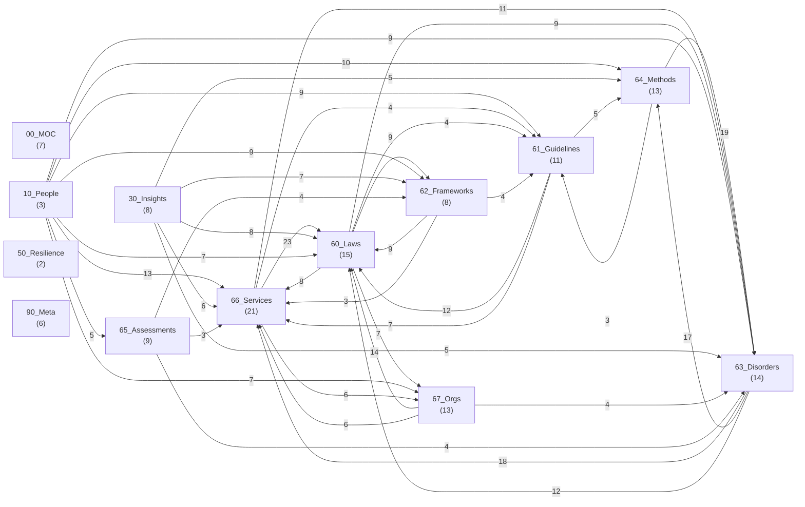

<!-- allow-realname -->
---
type: meta
updated: 2026-04-21
tags: [meta, overview]
cssclasses: [layer-meta]
---

# welfare-graph 俯瞰ダッシュボード

**最終更新**: 2026-04-21（`generate_overview.py` により自動生成）

本ファイルは [[CLAUDE#§3 動作モード（5 + 2）]] の overview モード出力。
手動編集は行わず、`python3 90_Meta/scripts/generate_overview.py` で再生成すること。

---

## 📊 全体サマリ

- **総ノート数**: 130
- **総 relations**: 431
- **平均 relations/ノート**: 3.3

## 🗂 層別ページ数

| 層 | 件数 |
|---|---|
| 00_MOC | 7 |
| 10_People | 3 |
| 30_Insights | 8 |
| 50_Resilience | 2 |
| 60_Laws | 15 |
| 61_Guidelines | 11 |
| 62_Frameworks | 8 |
| 63_Disorders | 14 |
| 64_Methods | 13 |
| 65_Assessments | 9 |
| 66_Services | 21 |
| 67_Orgs | 13 |
| 90_Meta | 6 |

## 📑 type 別ページ数

| type | 件数 |
|---|---|
| service | 20 |
| law | 14 |
| disorder | 13 |
| org | 12 |
| method | 12 |
| guideline | 10 |
| insight | 8 |
| layer-readme | 8 |
| moc | 7 |
| framework | 7 |
| assessment | 7 |
| meta | 6 |
| person | 3 |
| care_role | 1 |
| substitute | 1 |

## 🔄 status 別ページ数

| status | 件数 |
|---|---|
| active | 128 |
| archived | 1 |
| 検討中 | 1 |

## 🚨 改正追随状況

- pending-amendment（改正予告中）: 0 件
- review_due 超過: 0 件
- 3 か月以内に review_due: 0 件

## 🔗 被参照ノート Top 15

| 順位 | ノート | 被参照数 |
|---|---|---|
| 1 | [[60_Laws/障害者総合支援法]] | 42 |
| 2 | [[63_Disorders/自閉スペクトラム症]] | 20 |
| 3 | [[63_Disorders/知的障害]] | 17 |
| 4 | [[63_Disorders/強度行動障害]] | 13 |
| 5 | [[61_Guidelines/意思決定支援ガイドライン]] | 12 |
| 6 | [[60_Laws/障害者虐待防止法]] | 12 |
| 7 | [[62_Frameworks/ICF]] | 11 |
| 8 | [[60_Laws/障害者差別解消法]] | 10 |
| 9 | [[66_Services/就労移行支援]] | 10 |
| 10 | [[64_Methods/構造化支援]] | 8 |
| 11 | [[60_Laws/発達障害者支援法]] | 8 |
| 12 | [[60_Laws/精神保健福祉法]] | 8 |
| 13 | [[62_Frameworks/合理的配慮]] | 7 |
| 14 | [[63_Disorders/統合失調症]] | 7 |
| 15 | [[66_Services/就労定着支援]] | 7 |

## 📅 最近の変更（git log 直近 15 件）

| commit | date | message |
|---|---|---|
| `64adb98` | 2026-04-21 | feat: 合理的配慮フレームワークをハブページとして新設 |
| `0d687ac` | 2026-04-21 | feat: 合理的配慮関連判例 2 件を ingest |
| `a7fb6b9` | 2026-04-21 | feat: data-wiki CLAUDE.md 規約を準拠する vault 運用マニュアルを策定 |
| `ac4ba82` | 2026-04-20 | feat(mcp): welfare-graph MCP サーバーを実装 — Claude Desktop / Code から照会可能に |
| `366ba78` | 2026-04-20 | feat: 進化する知識グラフ機構 — 法令改正追随システムを実装 |
| `c4b1d5f` | 2026-04-20 | feat: raw → wiki 取り込みワークフローと七生養護学校事件の取り込み |
| `6576e2d` | 2026-04-20 | docs: 相談支援専門員向けの使用説明書を追加 |
| `6b4199f` | 2026-04-20 | 初期公開: welfare-graph — 相談支援専門員のための知識グラフ |
| `9e9053e` | 2026-04-20 | Initial commit |

## 🕸 層間関係グラフ（Mermaid）

relations が 3 件以上ある層間接続を表示。数字は接続数。



---

## 🔧 再生成

```bash
python3 90_Meta/scripts/generate_overview.py
```

関連: [[CLAUDE]] / [[90_Meta/SCHEMA]] / [[90_Meta/amendment-tracking]] / [[README]]